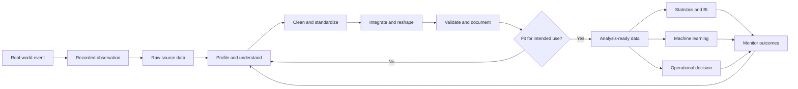
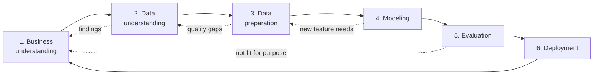
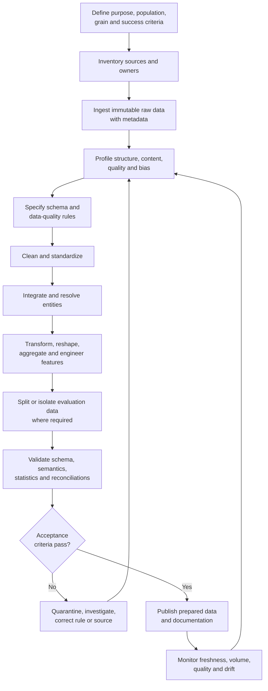
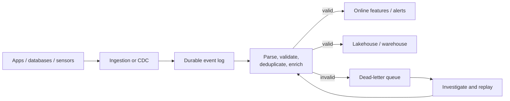

# Real-World Data Preparation with Python

> A practitioner-led, evidence-aware guide to turning raw observations into trustworthy, analysis-ready, model-ready, and decision-ready data.

[](https://www.python.org/)
[](#project-status-and-roadmap)
[](#what-data-preparation-really-means)
[](#crisp-dm-the-project-level-map)

## Executive summary

Most failed data products do not fail because an analyst forgot an exotic algorithm. They fail because the team misunderstood the business question, trusted an undocumented field, joined tables at the wrong grain, confused a missing value with zero, allowed future information into training data, duplicated customers, ignored changing source systems, or deployed a transformation that could not be reproduced.

**Data preparation is the disciplined work that prevents those failures.** It converts data collected for one purpose into a defensible representation for another purpose while preserving meaning, lineage, privacy, and the ability to audit what happened.

This repository is being built as a long-form learning and reference project for:

- students of data analysis, data science, statistics, and data engineering;
- analysts moving from spreadsheets or notebooks to reliable workflows;
- lecturers and trainers who need realistic teaching cases;
- professionals preparing operational, research, financial, public-sector, or machine-learning data; and
- decision-makers who need to understand why “cleaning the data” is not a minor technical chore.

The central argument is simple:

> A result can be mathematically correct and still be operationally wrong if the data was prepared for the wrong population, time window, unit of analysis, definition, or decision.

This README establishes the conceptual map. Future notebooks, datasets, tests, case studies, and pipelines should turn each part of that map into executable practice.

---

## Explained simply, before anything else

Skip this section if you already work with data daily. Read it first if you do not, because every later section assumes you already understand the two sentences below.

### What is "data," really?

Data is just **recorded facts about something that happened or something that exists** — a sale, a patient visit, a temperature reading, a click on a website. Someone or something (a person, a form, a sensor, an app) had to *observe* the fact and *write it down* in some format. That act of recording is never perfect: it happens through a specific system, at a specific time, by a specific method, for a specific reason. So data is not "the truth itself" — it is **a recording of the truth, made under specific conditions, for a specific original purpose.**

That gap — between what actually happened and what got written down — is the reason preparation exists at all.

### What is "data preparation," in one sentence?

> **Data preparation is the work of taking data that was recorded for one reason and getting it into a trustworthy, correctly-structured shape for a *different* reason — the analysis, report, or model you actually want to build.**

An analogy: imagine data as raw ingredients delivered to a kitchen. The delivery truck does not hand the chef a finished meal — it hands over vegetables with soil still on them, meat that needs trimming, and packages with damaged labels. Before any cooking (the "analysis") can start, someone has to wash, sort, cut to the right size, check nothing is spoiled, and put ingredients in the right containers. **That washing-and-sorting stage is data preparation.** Skip it, and the meal (your report, dashboard, or model) can still come out looking fine on the plate — while actually being unsafe, mismeasured, or wrong.

A few of the biggest words in this README, defined the plain way before you meet the technical version later on:

| You will read this term | In plain words, it means |
|---|---|
| **Raw data** | The data exactly as it arrived — nobody has touched it yet, soil and all. |
| **Clean data** | Data where known mistakes (typos, impossible values, exact duplicates) have been fixed or flagged. |
| **Tidy data** | Data arranged in a simple, predictable table shape: one column per variable, one row per observation — so tools and formulas behave predictably. |
| **Missing data** | A value that should exist but was not recorded — different from a real "zero" or "none." |
| **Duplicate** | The same real-world event or person appearing in the data more than once by accident. |
| **Outlier** | A value far outside the normal range — which might be an error, or might be a real rare event worth investigating rather than deleting. |
| **Grain** (of a dataset) | The plain answer to "what does *one row* actually represent?" — one customer? one order? one day? Get this wrong and every count downstream is wrong too. |
| **Pipeline** | A repeatable, automated sequence of steps that takes raw data in and produces prepared data out, the same way every time. |
| **Model-ready / analysis-ready data** | Data that has cleared all of the above and is now safe to feed into a chart, a statistical test, or a machine-learning model. |

Why does this matter enough to be its own discipline? Because a chart, statistic, or prediction built on badly prepared data can look completely normal and still be **wrong** — there is usually no error message. The computer will happily calculate an average of a column that mixes dollars and shillings, or count "customers" twice because the same person appears under two spellings of their name. Nothing crashes. The number is just quietly false. That is the entire reason this repository exists: to make the invisible, unglamorous, and most decision-critical stage of data work visible, explicit, and testable — before the "real" analysis ever begins. Everything from here on expands on this one idea in increasing technical depth.

---

## Table of contents

1. [Explained simply, before anything else](#explained-simply-before-anything-else)
2. [The project in one view](#the-project-in-one-view)
3. [What data preparation really means](#what-data-preparation-really-means)
4. [Why preparation matters](#why-preparation-matters)
5. [A short history of usable data](#a-short-history-of-usable-data)
6. [Where preparation sits in the data lifecycle](#where-preparation-sits-in-the-data-lifecycle)
7. [The complete preparation workflow](#the-complete-preparation-workflow)
8. [Core preparation activities](#core-preparation-activities)
9. [Real-world cases by industry](#real-world-cases-by-industry)
10. [Batch, streaming, and real-time preparation](#batch-streaming-and-real-time-preparation)
11. [Data quality and acceptance criteria](#data-quality-and-acceptance-criteria)
12. [Why Python is a leading choice](#why-python-is-a-leading-choice)
13. [The modern tool landscape](#the-modern-tool-landscape)
14. [A professional Python pattern](#a-professional-python-pattern)
15. [Preparation for machine learning](#preparation-for-machine-learning)
16. [Governance, privacy, security, and ethics](#governance-privacy-security-and-ethics)
17. [Production readiness](#production-readiness)
18. [Common failure modes](#common-failure-modes)
19. [Project status and roadmap](#project-status-and-roadmap)
20. [Glossary and acronyms](#glossary-and-acronyms)
21. [References and further reading](#references-and-further-reading)

---

## The project in one view



The diagram contains three lessons that should govern this repository:

1. **Raw data is not the real world.** It is a recorded and therefore imperfect representation of the real world.
2. **“Clean” is not an absolute property.** Data is fit—or unfit—for a specified use.
3. **Preparation is iterative.** New findings, outcomes, schema changes, and stakeholder feedback send the team back through the cycle.

### The questions every case study must answer

Every worked project added to this repository should make the following explicit:

| Question | Why it matters |
|---|---|
| What decision or claim will the data support? | Prevents technically impressive but irrelevant work. |
| Who or what does one row represent? | Defines the **grain** or unit of analysis. |
| What population and time period are in scope? | Prevents denominator, selection, and temporal errors. |
| Where did each field originate? | Establishes provenance and accountability. |
| What does missing mean in each column? | “Unknown,” “not applicable,” “not yet observed,” and zero are different states. |
| Which transformations are legitimate? | A mathematically possible transformation may destroy business meaning. |
| What quality rules must pass? | Turns subjective confidence into testable acceptance criteria. |
| What information is sensitive? | Determines access, minimization, masking, retention, and sharing rules. |
| Can the result be reproduced? | Manual, undocumented edits cannot support a durable data product. |
| What may change after deployment? | Sources, definitions, distributions, and behavior all drift. |

---

## What data preparation really means

### A working definition

**Data preparation** is the controlled process of discovering, assessing, selecting, cleaning, standardizing, integrating, transforming, validating, documenting, and delivering data so that it is fit for a clearly stated analytical, scientific, operational, or machine-learning purpose.

It includes—but is much larger than—data cleaning.

```text
Data preparation
├── business and domain understanding
├── acquisition and ingestion
├── profiling and quality assessment
├── cleaning and error treatment
├── integration and entity resolution
├── transformation and reshaping
├── feature and label construction
├── validation and testing
├── documentation and lineage
└── publication, monitoring, and maintenance
```

### Terms that are related but not identical

| Term | Practical meaning | Relationship to preparation |
|---|---|---|
| **Data cleaning / cleansing** | Correcting or managing inaccurate, incomplete, inconsistent, duplicated, or invalid values. | One subset of preparation. |
| **Data wrangling / munging** | Informal or exploratory reshaping and manipulation, often interactively. | Usually a hands-on part of preparation. |
| **Data preprocessing** | Transformations performed before a specific algorithm or analysis. | Often narrower and model-oriented. |
| **ETL** | Extract from sources, transform, then load into a target system. | A pipeline pattern that carries out preparation. |
| **ELT** | Extract, load raw data, then transform inside the target platform. | Common in cloud warehouses and lakehouses. |
| **Feature engineering** | Constructing model inputs from source variables. | A machine-learning-specific preparation activity. |
| **Data integration** | Combining sources while reconciling keys, definitions, and grain. | One of the most consequential preparation stages. |
| **Data curation** | Selecting, organizing, annotating, preserving, and governing data for use and reuse. | Emphasizes stewardship and long-term value. |
| **Data engineering** | Building systems that collect, transport, transform, store, and serve data reliably. | Operationalizes preparation at scale. |

### “Raw,” “clean,” and “ready” are contextual

- **Raw data** should be an immutable or access-controlled copy of what was received, plus ingestion metadata. It may already contain upstream transformations.
- **Clean data** has passed defined correction and quality rules; it is not guaranteed to be appropriate for every use.
- **Tidy data** commonly means that each variable is a column, each observation is a row, and each observational unit forms a table. This layout is powerful, but hierarchical, graph, image, audio, geospatial, and event data may require other structures.
- **Analysis-ready data** has the correct population, grain, variables, types, definitions, and quality for a named analysis.
- **Model-ready data** additionally has leakage-safe features, labels, splits, encodings, and preprocessing behavior that can be reproduced at inference time.
- **Decision-ready data** includes enough context, uncertainty, timeliness, and governance for a person or system to take action.

---

## Why preparation matters

### The chain from defect to consequence

| Preparation defect | Analytical consequence | Business or social consequence |
|---|---|---|
| Duplicate orders | Revenue counted twice | Incorrect forecasts, commissions, or taxes |
| Mixed currencies | Invalid totals and comparisons | Bad pricing or investment decisions |
| Dates parsed in mixed day/month order | Events assigned to the wrong period | False trends and missed deadlines |
| A customer-to-order join performed many-to-many | Row multiplication | Inflated customer value and campaign waste |
| Missing blood pressure encoded as `0` | Biased distribution and model | Unsafe clinical prioritization |
| Closed accounts excluded from churn history | Survivorship bias | Model appears better than it is |
| Future transactions used in a training feature | Target leakage | Excellent offline score, poor production performance |
| Unrecorded sensor outage treated as zero demand | False low-demand signal | Stockouts or equipment misconfiguration |
| Names used as identity keys | False merges and missed matches | Misallocated benefits or duplicated customers |
| Protected attributes removed but proxies retained | Hidden discrimination | Unfair or unlawful automated decisions |

### The value created by good preparation

Good preparation improves:

- **validity** — the data represents the intended concept and population;
- **accuracy** — values are sufficiently close to the truth for the use case;
- **consistency** — definitions and formats agree across systems and time;
- **reproducibility** — another person or machine can obtain the same result;
- **efficiency** — analysts stop repairing the same defect independently;
- **model performance** — useful signal is represented and leakage is prevented;
- **trust** — stakeholders can trace metrics to definitions and sources;
- **compliance** — sensitive data is handled according to purpose and law; and
- **maintainability** — changes fail visibly instead of silently corrupting outputs.

### About the famous “80%” claim

Statements such as “data scientists spend 80% of their time cleaning data” are useful warnings, but they are not natural laws. Survey results vary by role, organization, tooling, data maturity, and by what respondents count as preparation. This project will not use a single percentage as proof of importance. The stronger evidence is operational: preparation spans multiple CRISP-DM tasks, determines whether assumptions hold, and is repeatedly identified in practice as a major effort. IBM’s CRISP-DM documentation, for example, states that preparation usually requires most effort in a data-mining project, without pretending the share is universal ([IBM](https://www.ibm.com/docs/en/db2/11.1.0?topic=studio-data-preparation-in-mining-process)).

### The cost-of-error principle

The right amount of preparation depends on the consequence of being wrong:

| Use case | Typical tolerance | Appropriate controls |
|---|---|---|
| One-off exploratory chart | Moderate, if clearly labeled | Profiling, reasonableness checks, documented caveats |
| Monthly management report | Low | Reconciliations, stable definitions, automated tests, review |
| Customer marketing | Low to moderate | Consent/purpose checks, deduplication, suppression rules |
| Financial reporting | Very low | Controlled sources, audit trail, reconciliation, approvals |
| Clinical or safety decision | Extremely low | Domain validation, rigorous QA, monitoring, human oversight |
| Production ML decision | Context-dependent but often low | Leakage-safe pipeline, fairness checks, drift monitoring, rollback |

---

## A short history of usable data

### There was no single “founder of data”

Humans have recorded harvests, taxes, trade, populations, and astronomical observations for millennia. “Data” is not an invention attributable to one founder. Modern practice emerged from several connected traditions:

- record keeping and censuses;
- probability and statistical inference;
- public-health and social measurement;
- experimental design;
- statistical graphics;
- mechanical and electronic computation;
- databases and information management; and
- data analysis, machine learning, and data engineering.

The important historical question is therefore not “Who invented data?” but:

> Who developed influential ways to collect, structure, check, summarize, visualize, compute, and reason from recorded observations?

### Selected milestones

| Year | People / institution | Contribution | Connection to preparation |
|---:|---|---|---|
| **1654** | Blaise Pascal and Pierre de Fermat | Correspondence on games of chance helped establish mathematical probability. | Formalized reasoning under uncertainty—the condition in which incomplete observations are analyzed. |
| **1662** | **John Graunt** | Analyzed decades of London’s *Bills of Mortality*, consolidating irregular records into interpretable tables and estimates. The Royal Society credits the work with helping launch demography and medical statistics ([Royal Society](https://royalsociety.org/news/2011/new-exhibition-reveals-rarely-seen-account-of-life-and-death-in-17th-century-london/)). | An early, recognizable example of extracting, categorizing, aggregating, checking, and interpreting messy administrative data. |
| **1763** | Thomas Bayes; published by Richard Price | Bayes’s essay appeared posthumously and became foundational to updating probability with evidence. | Modern imputation, probabilistic models, and uncertainty-aware decisions inherit this tradition. |
| **1786** | **William Playfair** | Published *The Commercial and Political Atlas*, popularizing statistical line and bar charts; his 1801 work included an early pie chart ([ETS](https://www.ets.org/research/policy_research_reports/publications/report/1998/icms.html)). | Visualization became a tool for detecting, communicating, and questioning data patterns. |
| **1850s** | **Florence Nightingale** and **William Farr** | Analyzed mortality and sanitation data and communicated findings with polar-area and other charts ([Royal Statistical Society](https://rss.org.uk/training-events/events/events-2024/sections/florence-nightingale-and-statistics-from-then-to-n/)). | Shows that definition, comparison groups, standardization, and communication can turn administrative records into public-health action. |
| **1890** | **Herman Hollerith** and the U.S. Census | Punch cards and electrical tabulating machines processed census returns and reduced clerical work ([U.S. Census Bureau](https://www.census.gov/history/pdf/measuringamerica.pdf)). | Encoding schemes and machines made validation, classification, aggregation, and large-scale processing systematic. |
| **1920s–1930s** | **Ronald A. Fisher** and others | Advanced experimental design, randomization, analysis of variance, and statistical inference. | Demonstrated that useful analysis begins with how data is generated—not with a repair after collection. |
| **1962** | **John W. Tukey** | Published “The Future of Data Analysis,” arguing for data analysis as a broad empirical science ([DOI](https://doi.org/10.1214/aoms/1177704711)). | Elevated iterative exploration, residual examination, transformation, and practical engagement with data. |
| **1970** | **Edgar F. Codd** | Proposed the relational model in “A Relational Model of Data for Large Shared Data Banks” ([IBM Research](https://research.ibm.com/publications/a-relational-model-of-data-for-large-shared-data-banks)). | Relations, keys, normalization, and data independence transformed how structured data is stored and combined. |
| **1970s** | Donald Chamberlin, Raymond Boyce, Patricia Selinger, and IBM System R teams | Developed SQL concepts and cost-based query optimization; Selinger’s work helped make relational queries practical ([IBM](https://www.ibm.com/history/patricia-selinger)). | Declarative transformation, joins, query plans, and scalable preparation became industrial capabilities. |
| **1977** | **John W. Tukey** | Published *Exploratory Data Analysis*. | Cemented resistant summaries and visualization as ways to discover structure and anomalies before formal modeling. |
| **1989–1996** | Gregory Piatetsky-Shapiro, Usama Fayyad, Padhraic Smyth, and the KDD community | Developed knowledge discovery in databases as a broader process around data mining. | Positioned selection, preprocessing, transformation, interpretation, and evaluation around algorithms. |
| **1991** | **Guido van Rossum** | Publicly released Python after developing it at CWI; Python’s official history places its creation in the early 1990s ([Python documentation](https://docs.python.org/3/license.html#history-of-the-software)). | A readable general-purpose language later became the connective layer for data access, automation, statistics, and ML. |
| **1996** | NumPy predecessors and the Scientific Python community | Numeric brought efficient array computing to Python; Numarray followed. | Vectorized, typed computation made numerical preparation practical. |
| **1999–2000** | Pete Chapman, Julian Clinton, Randy Kerber, Thomas Khabaza, Thomas Reinartz, Colin Shearer, Rüdiger Wirth, and the CRISP-DM consortium | Published **CRISP-DM**, a cross-industry lifecycle with six iterative phases. | Made data understanding and data preparation explicit project phases rather than invisible chores. |
| **2005** | **Travis Oliphant** and contributors | Created NumPy by unifying and extending earlier array work ([NumPy](https://numpy.org/about/)). | Supplied the efficient array foundation of much of the Python data ecosystem. |
| **2008** | **Wes McKinney** and contributors | Began pandas; it developed labeled `Series` and `DataFrame` abstractions for practical data work ([pandas overview](https://pandas.pydata.org/docs/getting_started/overview.html)). | Made joins, missing-data handling, reshaping, grouping, and time-series manipulation accessible in Python. |
| **2010s** | Open-source and cloud data communities | Spark, Arrow, Parquet, cloud warehouses, lakehouses, workflow orchestrators, and data-quality tools matured. | Preparation expanded from scripts into distributed, observable, contract-tested data products. |
| **2016** | Mark Wilkinson, Michel Dumontier, Barend Mons, and many collaborators | Published the **FAIR** principles: Findable, Accessible, Interoperable, Reusable ([Scientific Data](https://doi.org/10.1038/sdata.2016.18)). | Connected preparation with metadata, identifiers, standards, provenance, and reuse. |

### What history actually teaches us

The need for preparation was not discovered in one dramatic moment. It became visible every time people tried to compare records that used different categories, count populations at scale, distinguish signal from recording error, merge information, reproduce a calculation, or act on evidence. The technology changed—from bills and ledgers to punch cards, relational tables, dataframes, and distributed engines—but the intellectual problems remain familiar:

- What exactly was observed?
- How was it encoded?
- Which records belong together?
- What is absent, erroneous, duplicated, or incomparable?
- What transformation preserves the meaning needed for this decision?
- Can another person verify the path from source to conclusion?

---

## Where preparation sits in the data lifecycle

### CRISP-DM: the project-level map

**CRISP-DM** means **Cross-Industry Standard Process for Data Mining**. It is an iterative lifecycle, not a rigid waterfall. IBM describes six connected phases and explicitly notes that projects move back and forth between them ([IBM CRISP-DM overview](https://www.ibm.com/docs/en/spss-modeler/saas?topic=dm-crisp-help-overview)).



| Phase | Central question | Representative deliverables |
|---|---|---|
| **Business understanding** | What decision, constraint, and success measure matter? | Problem statement, stakeholders, risks, analytical objective, acceptance criteria |
| **Data understanding** | What data exists and what does it really represent? | Source inventory, data dictionary, initial profile, quality report, bias hypotheses |
| **Data preparation** | How must data be selected and transformed for the task? | Reproducible pipeline, integrated dataset, feature/label definitions, validation report |
| **Modeling** | Which analytical or learning method fits the objective and data? | Baselines, trained models, assumptions, tuning records |
| **Evaluation** | Is the result statistically, operationally, ethically, and commercially adequate? | Error analysis, business validation, fairness/safety checks, go/no-go decision |
| **Deployment** | How will the result be used and maintained? | Report, dashboard, API, batch output, monitoring, ownership, rollback plan |

Preparation is shown as one phase, but preparation thinking occurs throughout the lifecycle. A business definition determines which rows to select; modeling reveals representation problems; deployment requires identical transformations on new data; monitoring discovers drift and sends the team back.

### Other useful frameworks

| Framework | Expansion / focus | When it helps |
|---|---|---|
| **KDD** | Knowledge Discovery in Databases | Distinguishes the broader discovery process from the data-mining algorithm. |
| **SEMMA** | Sample, Explore, Modify, Model, Assess | A modeling-centered workflow historically associated with SAS. |
| **TDSP** | Team Data Science Process | Team roles, lifecycle artifacts, and production delivery. |
| **OSEMN** | Obtain, Scrub, Explore, Model, iNterpret | A memorable teaching sequence; less complete for governance and operations. |
| **FAIR** | Findable, Accessible, Interoperable, Reusable | Research-data stewardship and durable reuse. |
| **MLOps** | Machine Learning Operations | Repeatable training, deployment, monitoring, and governance of ML systems. |
| **DataOps** | Collaborative and automated data operations | Reliable delivery, testing, observability, and continuous improvement of data products. |

No acronym replaces judgment. Frameworks are checklists for attention; the domain, risk, and decision determine the actual work.

---

## The complete preparation workflow

Preparation should be a controlled sequence with feedback, not a pile of unrelated fixes.



### 1. Frame the use before touching the values

Write a preparation brief:

- decision or research question;
- expected output and consumer;
- unit of analysis (**grain**);
- entity, event, geography, and time boundaries;
- target population and exclusions;
- definitions of the outcome, features, measures, and dimensions;
- quality thresholds and reconciliation totals;
- privacy classification and permitted purpose;
- required refresh frequency and latency; and
- cost of false positives, false negatives, delay, and data loss.

**Example:** “Predict churn” is not yet an analytical specification. A better statement is: “At 00:00 EAT every Monday, score active prepaid subscribers who have at least 30 days of history for the probability of having no revenue-generating activity during the following 30 days, so the retention team can select at most 20,000 eligible contacts.” This defines the observation time, population, label window, cadence, action, and capacity.

### 2. Inventory and acquire data

For every source record:

- system and business owner;
- authoritative status—system of record, replica, export, or manually maintained file;
- collection mechanism and original purpose;
- location and access method;
- schema, format, encoding, timezone, and units;
- key fields and expected grain;
- refresh schedule, latency, and retention;
- known changes, gaps, and quality issues;
- security classification and lawful/permitted use; and
- extraction timestamp, source version, query, checksum, or snapshot identifier.

Typical sources include relational databases, APIs, event streams, spreadsheets, survey tools, web logs, documents, sensors, images, geospatial systems, public datasets, and third-party vendors.

### 3. Preserve a raw layer

A professional workflow normally preserves a read-only or access-controlled source-aligned layer. Do not silently overwrite original evidence. Raw-zone controls may include:

- time-partitioned snapshots;
- content hashes and file sizes;
- extraction logs and row counts;
- schema captures;
- encrypted storage and least-privilege access;
- retention and deletion policies; and
- explicit handling for late, corrected, or retracted source records.

“Raw” does not mean “public,” “safe,” or “kept forever.” Privacy and retention obligations still apply.

### 4. Profile before prescribing fixes

Profile at four levels:

| Level | Questions |
|---|---|
| **Dataset** | How many rows/columns? What period? Is the file readable? Are batches missing? |
| **Schema** | Are names, order, types, nullability, and nested structures as expected? |
| **Column** | What are null, distinct, zero, negative, min/max, quantile, pattern, and length distributions? |
| **Relationship** | Are keys unique? Are foreign keys valid? Do joins change row counts unexpectedly? |

Also profile by meaningful segments and time. A dataset can look healthy overall while one facility, product, gender, device version, or recent month is badly incomplete.

### 5. Write rules before making irreversible corrections

Separate three kinds of knowledge:

1. **Structural rules** — types, required columns, uniqueness, referential integrity.
2. **Domain rules** — discharge cannot precede admission; quantity cannot be negative unless it represents a return.
3. **Statistical expectations** — daily volume normally falls within a learned interval; distribution should not shift abruptly.

Decide the response to failure: reject the batch, quarantine rows, warn and continue, substitute a governed default, or escalate to the source owner. Silent coercion is rarely a safe default.

### 6. Transform without losing lineage

Every material output field should be traceable to:

```text
source system → source table/file → source field(s) → rule/version → output field
```

Keep transformations deterministic when possible, parameterized when necessary, and reviewed like software. If judgment is manual—such as labeling text—retain guidelines, reviewer identity where appropriate, disagreement resolution, and annotation version.

### 7. Validate at the boundaries

Test after ingestion, after important joins or aggregations, and before publication. Boundary tests catch defects nearer their cause and make debugging cheaper.

### 8. Publish a data product, not an unexplained file

A prepared dataset should travel with:

- owner and support contact;
- purpose and permitted uses;
- schema and data dictionary;
- grain, keys, population, and time coverage;
- units and business definitions;
- transformation and lineage documentation;
- quality test results and known limitations;
- refresh/freshness commitments;
- version and change log; and
- retention, access, and deprecation policy.

---

## Core preparation activities

### Data selection and filtering

- Select only relevant fields and records; unnecessary data increases privacy risk, cost, and confusion.
- Define inclusion and exclusion rules explicitly.
- Distinguish sampling for exploration from population filtering for the final analysis.
- Check selection bias: the data you can access may not represent the people or events about which you intend to conclude.

### Data types and parsing

Common traps include identifiers interpreted as numbers, leading zeros removed from codes, dates inferred with the wrong locale, booleans represented by several strings, and currency stored with symbols.

Recommended principles:

- parse explicitly rather than relying on accidental inference;
- preserve original values when coercion may fail;
- record parse-failure counts and examples;
- use timezone-aware datetimes for events across locations;
- store identifiers as strings unless arithmetic is meaningful;
- use decimal arithmetic where exact financial rounding is required; and
- attach units to field definitions, not only column names.

### Missing data

Missingness is information about the data-generating process. First distinguish:

| Missing state | Example | Typical treatment question |
|---|---|---|
| **Unknown** | Customer did not provide age | Can “unknown” be modeled as a meaningful category? |
| **Not applicable** | Pregnancy status for an inapplicable population | Should this be structurally excluded rather than imputed? |
| **Not yet observed** | Outcome window is incomplete | Must the record wait before labeling? |
| **Not collected** | Old form version lacked the question | Is missingness tied to time/system and therefore biased? |
| **Suppressed** | Small count hidden for privacy | Must suppression be preserved through aggregation? |
| **Lost / corrupt** | Sensor packet failed | Can a neighboring measurement defensibly estimate it? |

Statistical terminology:

- **MCAR** — Missing Completely At Random;
- **MAR** — Missing At Random conditional on observed variables; and
- **MNAR** — Missing Not At Random, meaning missingness depends on unobserved value or process.

Do not apply mean imputation by habit. Options include retaining a missing indicator, domain-specific substitution, group/time-aware interpolation, model-based imputation, multiple imputation, excluding a field, or redesigning collection. Fit imputation only on training data in predictive work.

### Duplicate management

Duplicates occur at different levels:

- byte-identical rows;
- repeated events legitimately emitted more than once;
- multiple records for the same real-world entity;
- retries in event delivery;
- slowly changing records with valid history; or
- true repeated observations that must not be removed.

Deduplication therefore needs a business key and a survivor policy. “Drop all duplicate rows” is not entity resolution.

### Entity resolution and record linkage

When no stable common identifier exists, teams may use normalized names, addresses, phones, emails, dates, location, probabilistic similarity, or reference registries. Document:

- normalization rules;
- blocking/candidate generation;
- comparison features and thresholds;
- false-match and missed-match risks;
- canonical identity and merge/unmerge behavior; and
- human review for ambiguous or high-consequence matches.

Identity errors can harm people. Use the least personal data necessary and secure matching artifacts.

### Categories and codes

- Normalize case and whitespace without erasing meaningful distinctions.
- Map spelling variants through a versioned reference table.
- Keep source value, standardized value, mapping version, and mapping status.
- Distinguish `other`, `unknown`, `not applicable`, and invalid.
- Prepare for unseen categories in future data.
- Avoid ordinal encoding for unordered categories unless the model safely treats it as nominal.

### Text preparation

Depending on the purpose, text work may include Unicode normalization, language identification, whitespace handling, tokenization, spelling normalization, removal or masking of personally identifiable information (PII), document segmentation, metadata extraction, and label quality review.

Do not automatically lowercase, remove punctuation, strip accents, delete stopwords, or stem text. These actions may remove sentiment, identity, negation, product codes, legal meaning, or language-specific information.

### Dates, time, and events

Time preparation must define:

- event time versus ingestion/processing time;
- timezone and daylight-saving behavior;
- observation cutoff and reporting period;
- late-arriving and out-of-order events;
- effective dates for changing reference data;
- calendar, fiscal, academic, or epidemiological periods;
- point-in-time correctness; and
- duration, interval boundaries, and inclusive/exclusive endpoints.

Never build a historical feature using a customer status that was updated after the historical prediction time.

### Units, currencies, and measurement

Preserve original unit and value, then create standardized fields. Use effective-dated conversion rates and cite their source. Distinguish nominal currency from inflation-adjusted value. For physical measurements, check device calibration, precision, detection limits, and unit conversions.

### Outliers and anomalies

An outlier may be:

- a typing or sensor error;
- a valid rare event;
- a population outside scope;
- fraud or system abuse;
- evidence of a changed process; or
- exactly the event the analysis should discover.

Detection methods—domain bounds, IQR, robust z-scores, isolation methods, time-series residuals—do not decide treatment. Investigate context. Possible actions are correction from source, retention, transformation, winsorization with justification, robust modeling, separate segmentation, or quarantine. Always report how many records changed.

### Integration and joins

Before every join, state:

- grain of left and right tables;
- expected key cardinality: one-to-one, one-to-many, many-to-one, or intentionally many-to-many;
- expected matched/unmatched rates;
- expected row count after the join;
- treatment of null keys and duplicate keys;
- time-valid matching rule; and
- which table owns conflicting attributes.

```text
If left has one row per customer and right has many orders per customer,
joining orders is one-to-many and intentionally changes the left grain.
Aggregating orders first may preserve one row per customer.
```

Use join assertions. A join that runs successfully can still be logically wrong.

### Reshaping and aggregation

- **Wide to long** makes repeated measure columns into variable/value rows.
- **Long to wide** creates columns from category values.
- **Aggregation** changes grain and must specify group keys, measure, function, time window, and missing-value behavior.
- **Window functions** calculate rolling, cumulative, ranking, or lagged values while preserving row-level context.

Totals are not always additive. Rates, ratios, distinct counts, balances, and percentages require their own aggregation logic.

### Scaling and mathematical transformation

Common methods include standardization, min-max scaling, robust scaling, log/power transforms, binning, normalization to unit length, and clipping. Apply them because model assumptions or numerical behavior require them—not to make every column look similar. Fit learned parameters on training data only and preserve the transformer for future inference.

### Feature engineering and labels

Features translate domain behavior into model inputs: recency/frequency/value, rolling statistics, trends, ratios, lags, seasonality, geospatial distance, text embeddings, or interaction terms. A label translates the outcome definition into data. Both require:

- an observation time;
- a lookback window;
- an outcome window;
- availability at prediction time;
- stable entity and event definitions; and
- tests for leakage and label delay.

### Sampling and dataset splitting

- Use random splits only when observations are sufficiently independent and deployment resembles the same distribution.
- Use group-aware splits to keep the same patient, customer, device, household, or site out of both train and test.
- Use time-based splits for forecasting and many deployed prediction systems.
- Stratify when appropriate, but do not let stratification reveal the future.
- Preserve a final untouched test set for honest evaluation.

---

## Real-world cases by industry

The table below emphasizes the preparation problem, not merely the algorithm.

| Domain and decision | Raw sources | Critical preparation work | Failure if neglected |
|---|---|---|---|
| **Banking — credit risk** | Applications, bureau records, accounts, repayments | Point-in-time bureau snapshot, entity matching, income/unit checks, delinquency label window, leakage controls, protected-group evaluation | Approving unaffordable loans, discrimination, misleading validation |
| **Banking — fraud detection** | Card events, merchants, devices, IPs, chargebacks | Event-time ordering, currency conversion, retry deduplication, velocity windows, delayed labels, class imbalance | Blocking genuine customers or missing fraud rings |
| **Insurance — claims** | Policies, claims, adjuster notes, images, payments | Policy-effective-date joins, coverage mapping, claimant/entity resolution, text/PII handling, reserve development | Incorrect pricing, leakage from claim settlement, unfair investigation |
| **Retail — demand forecasting** | POS transactions, promotions, inventory, stores, holidays, weather | Returns/cancellations, stockout flags, product hierarchy, store calendars, price/promo history, missing-sales versus zero-demand distinction | Overstocks, stockouts, false promotion effects |
| **E-commerce — recommendations** | Views, clicks, baskets, purchases, catalog | Bot filtering, sessionization, event deduplication, product availability, impression logs, temporal split | Popularity bias, recommending unavailable items, offline/online mismatch |
| **Telecommunications — churn** | Usage, airtime/data purchases, complaints, network quality | Subscriber/SIM/device identity, activity definition, observation/outcome windows, plan migrations, censoring | Contacting already-churned customers, leakage, wasted incentives |
| **Healthcare — patient risk** | EHR, laboratory, pharmacy, claims, bedside devices | Patient linkage, clinical code mapping, reference ranges/units, encounter timelines, duplicate tests, privacy and cohort definition | Unsafe triage, biased estimates, false clinical signals |
| **Public health — facility monitoring** | Routine reports, registers, population estimates | Completeness/timeliness, facility hierarchy, indicator definitions, denominator consistency, duplicate reports, outlier investigation | Misallocation of medicines and staff; false disease trends |
| **Manufacturing — predictive maintenance** | Vibration, temperature, maintenance logs, production runs | Clock synchronization, resampling, sensor calibration, outage detection, operating-regime segmentation, failure label definition | False alarms, missed failure, leakage from post-maintenance readings |
| **Energy — load forecasting** | Smart meters, grid sensors, weather, tariffs | Timezone/DST handling, meter resets, interval completeness, estimated-read flags, weather alignment | Incorrect generation planning and costly imbalance |
| **Transport — arrival time** | GPS pings, routes, schedules, traffic, weather | Map matching, trip segmentation, duplicate/out-of-order pings, route versioning, clock drift | Impossible routes and unreliable ETAs |
| **Agriculture — yield or disease risk** | Field surveys, satellite imagery, weather, soil sensors | Coordinate systems, cloud masking, spatial/temporal alignment, crop-cycle definition, plot boundaries, unit conversion | Wrong farm recommendations and biased regional estimates |
| **Government — social programmes** | Applications, civil registries, payments, household surveys | Household/entity resolution, eligibility-effective dates, geographic codes, audit trail, data minimization | Exclusion of eligible citizens, duplicate benefit, privacy harm |
| **Education — student success** | Enrolment, attendance, assessment, learning platforms | Student/course identity, term calendars, transfer history, assessment comparability, label timing, subgroup checks | Stigmatizing students and misleading intervention effects |
| **Cybersecurity — anomaly detection** | Authentication, endpoint, DNS, firewall, identity systems | Time synchronization, log normalization, asset/user identity, duplicate alerts, enrichment validity, rare-event labels | Alert fatigue or undetected compromise |
| **Scientific research — reproducible inference** | Instruments, experiments, surveys, field observations | Calibration, protocol deviations, codebooks, units, exclusions, blinding, missingness, provenance, versioned analysis set | Irreproducible or invalid scientific claims |
| **Natural-language AI — document system** | PDFs, emails, web pages, scans, knowledge bases | Permission and licensing, OCR quality, deduplication, language detection, chunking, PII/secrets, metadata, evaluation set | Privacy/copyright harm, stale answers, duplicate retrieval, hallucination amplification |

### A complete worked example: retail demand

Suppose a supermarket wants weekly item-store forecasts.

**Business grain:** one `store_id × product_id × week` row.

**Raw complications:**

- POS data has sales, returns, voids, and late corrections;
- a zero may mean no demand or no stock available to sell;
- product identifiers change after packaging revisions;
- stores trade on different holiday schedules;
- promotions begin midweek;
- prices are tax-inclusive in one source and exclusive in another;
- weather is hourly and geographically keyed, not store keyed; and
- discontinued products have censored future demand.

**Preparation design:**

1. Create canonical product and store dimensions with effective dates.
2. Reconcile POS totals to the financial sales ledger.
3. Convert returns and voids under an explicit net-sales rule.
4. Build a complete store-product-week spine so missing rows are distinguishable from zero sales.
5. Add inventory availability and flag stockout-censored demand.
6. Allocate promotion exposure by overlap with the week.
7. Map stores to weather stations and aggregate hourly weather without using future observations.
8. Construct lag and rolling features using only data available at each forecast cutoff.
9. Split training and evaluation by time, including ordinary and holiday periods.
10. Test totals, uniqueness, referential integrity, coverage, drift, and feature availability.

The forecasting algorithm is only one component. Most of the business meaning lives in preparation.

---

## Batch, streaming, and real-time preparation

“Real time” should be defined as a service requirement, not used as a fashionable synonym for “fast.”

| Mode | Typical latency | Examples | Preparation concerns |
|---|---:|---|---|
| **Batch** | Minutes to days | Month-end report, nightly warehouse load | Completeness, reruns, partitions, backfills, reconciliation |
| **Micro-batch** | Seconds to minutes | Near-real-time dashboard | Duplicate batches, checkpointing, freshness, late data |
| **Streaming** | Milliseconds to seconds | Fraud scoring, telemetry alert | Event time, watermarks, ordering, state, idempotency, schema evolution |
| **Request-time / online** | Per API request | Recommendation or credit decision | Low latency, feature freshness, online/offline consistency, fallback behavior |

### Streaming concepts that preparation specialists must know

- **Event time:** when the real-world event occurred.
- **Processing time:** when the platform processed it.
- **Watermark:** an estimate that controls how long to wait for late events.
- **Window:** a bounded grouping of event-time records—tumbling, sliding, or session.
- **Idempotency:** processing the same input more than once produces no additional effect.
- **At-most-once / at-least-once / exactly-once:** delivery or processing guarantees with different loss/duplication tradeoffs.
- **Change Data Capture (CDC):** propagating inserts, updates, and deletes from operational systems.
- **Dead-letter queue (DLQ):** isolated invalid events for investigation and possible replay.



Late data is not dirty merely because it is late; it may be a normal property of the system. The pipeline needs a stated correction policy for already-published aggregates and predictions.

---

## Data quality and acceptance criteria

### Quality is multidimensional and use-dependent

| Dimension | Working question | Example metric or test |
|---|---|---|
| **Accuracy** | Does the value agree sufficiently with reality or an authoritative source? | Sample verification rate; ledger reconciliation variance |
| **Completeness** | Are required fields, records, and periods present? | Non-null rate; expected facilities reporting / total facilities |
| **Validity** | Does data conform to schema, format, range, and domain rules? | Percentage matching allowed codes and constraints |
| **Consistency** | Do values agree across fields, systems, and time? | `discharge_at >= admission_at`; cross-system balance difference |
| **Uniqueness** | Are entities or events represented without unintended duplication? | Duplicate rate for the declared business key |
| **Timeliness** | Is data available soon enough for the decision? | Event-to-availability latency |
| **Freshness** | How old is the most recently available data? | Current time minus maximum trusted event time |
| **Integrity** | Are structural and referential relationships intact? | Orphan foreign-key count; join-cardinality assertion |
| **Coverage** | Does the data include the required population, geography, time, or behavior? | Covered stores / expected stores by region |
| **Representativeness** | Does the observed dataset reflect the target population relevant to the claim? | Segment distribution versus sampling frame |
| **Precision** | Is measurement/detail sufficiently exact? | Sensor resolution; decimal places; confidence interval |
| **Accessibility** | Can authorized users and systems obtain and interpret it? | Successful service level; metadata availability |
| **Lineage** | Can outputs be traced to sources and transformations? | Percentage of critical fields with field-level lineage |

WHO’s health-data guidance is a useful reminder that completeness, timeliness, internal consistency, and external comparison must be assessed systematically rather than assumed ([WHO Data Quality Assurance](https://www.who.int/data/data-collection-tools/health-service-data/data-quality-assurance-dqa)). Exact dimensions and thresholds should be adapted to the domain.

### A data quality rule should be executable

Weak requirement:

```text
The customer file should be clean and recent.
```

Testable contract:

```yaml
dataset: customer_snapshot
grain: one row per customer_id at snapshot_date
owner: customer-data-team
freshness:
  maximum_age: 26 hours
schema:
  required_columns: [customer_id, snapshot_date, status, country_code]
rules:
  - customer_id is never null
  - [customer_id, snapshot_date] is unique
  - status is one of [active, suspended, closed]
  - country_code conforms to the agreed reference list
  - snapshot_date is not in the future
  - row_count is between agreed control limits
response:
  hard_failure: stop publication and retain previous valid snapshot
  warning: publish with alert only for explicitly classified soft rules
```

### Reconciliation controls

Schema-valid data can still be incomplete or economically wrong. Reconcile critical datasets using:

- source-versus-target row counts;
- sums of controlled financial or quantity measures;
- distinct business keys;
- min/max event dates;
- matched and unmatched join populations;
- counts by status, geography, or source partition; and
- hash totals or record-level comparisons where justified.

### A practical quality scorecard

Do not collapse every dimension into one attractive but meaningless percentage. Report the dimensions and thresholds separately:

| Rule | Current | Threshold | Severity | Owner | Status |
|---|---:|---:|---|---|---|
| Required ID completeness | 99.998% | 100% | Critical | Source team | Fail |
| Daily file freshness | 3h 12m | ≤ 4h | Critical | Platform team | Pass |
| Valid currency codes | 99.7% | ≥ 99.9% | High | Finance data | Fail |
| Duplicate transaction keys | 0 | 0 | Critical | Payments | Pass |
| Unmatched merchant reference | 0.4% | ≤ 1% | Medium | Merchant data | Pass |

The scorecard should show consequences and ownership, not only colors.

### Data contracts

A **data contract** is an explicit agreement between producers and consumers about structure and behavior. It may cover:

- schema, types, nullability, keys, and semantic definitions;
- ownership and consumers;
- freshness, volume, availability, and quality expectations;
- compatibility and schema-evolution rules;
- classification, access, and retention;
- incident, deprecation, and communication procedures; and
- machine-readable tests.

A contract is not a substitute for collaboration. It makes collaboration testable and changes visible.

---

## Why Python is a leading choice

Python is not universally “the best” language for every preparation workload. SQL is often superior for set-based transformations inside a database; R is exceptional for statistical analysis; JVM and systems languages may be preferred for some high-throughput services; visual tools serve capable non-programmers. Python’s professional advantage is its breadth and ability to connect these worlds.

### The strongest reasons to choose Python

1. **Readable, teachable syntax** — domain experts can review transformation intent more easily than in many lower-level languages.
2. **One language across the lifecycle** — ingestion, APIs, files, profiling, cleaning, statistics, visualization, ML, testing, orchestration, and services can share a language.
3. **A mature dataframe and array foundation** — NumPy supplies efficient typed arrays and vectorized computation ([NumPy documentation](https://numpy.org/doc/stable/user/whatisnumpy.html)); pandas supplies labeled tabular structures, joins, missing-data handling, reshaping, grouping, I/O, and time-series operations ([pandas overview](https://pandas.pydata.org/docs/getting_started/overview.html)).
4. **Scale choices without abandoning Python** — Polars, DuckDB, Dask, PySpark, Ibis, Ray, and warehouse clients let a project move beyond one in-memory dataframe.
5. **Strong scientific and ML integration** — SciPy, statsmodels, scikit-learn, PyTorch, and domain libraries consume familiar array/dataframe structures.
6. **Automation and software engineering** — functions, packages, typing, logging, testing, CI/CD, APIs, and command-line tools turn exploration into maintainable production code.
7. **Interoperability** — Python reads databases, APIs, Excel, CSV, JSON, XML, Parquet, Arrow, images, documents, geospatial formats, and message streams.
8. **Open-source ecosystem and community** — users can inspect implementations, contribute fixes, and avoid a single proprietary workflow.
9. **Notebook-to-production path** — Jupyter enables exploration; modules, packages, tests, jobs, and services support operationalization.
10. **Performance escape hatches** — vectorized native libraries, Rust/C/C++ extensions, Arrow interchange, SQL pushdown, multiprocessing, distributed execution, and GPUs can handle performance-critical portions.

### Why Python sometimes performs poorly—and what that actually means

Poor Python data code often comes from choosing the wrong execution pattern:

- row-by-row loops instead of vectorized expressions;
- loading every column and row when predicate/column pushdown is possible;
- forcing data into laptop memory instead of querying or aggregating near storage;
- using CSV where typed columnar storage is appropriate;
- repeatedly copying large frames;
- mixing exploration, transformation, and I/O in one untestable notebook; or
- scaling infrastructure before fixing keys, grain, or business logic.

The solution may be better pandas, SQL, Polars, DuckDB, PyArrow, Spark, or a changed architecture—not simply “more hardware.”

### A balanced selection guide

| Situation | Strong starting choice | Reason |
|---|---|---|
| Spreadsheet-sized ad hoc exploration | pandas or Polars + Jupyter | Fast feedback and expressive manipulation |
| Larger-than-memory local analytical files | DuckDB, Polars lazy/streaming, or Dask | Pushdown, query planning, or partitioned execution |
| Data already in a relational warehouse | SQL/dbt plus Python for specialized logic | Move set-based work to the engine; keep transformations governable |
| Distributed large-scale batch/stream | PySpark or managed equivalent | Fault-tolerant distributed execution and ecosystem integration |
| Statistical research | Python or R based on team/library needs | Both have strong ecosystems; reproducibility matters more than rivalry |
| Low-code business preparation | Power Query, Alteryx, Tableau Prep, Dataiku, KNIME | Visual accessibility, with governance/versioning tradeoffs |
| Millisecond production event service | Streaming engine and an appropriate service stack | Latency/state guarantees dominate interactive convenience |

---

## The modern tool landscape

Tools change quickly. The durable skill is selecting a category based on data size, location, latency, team skill, governance, cost, and existing platform.

### Python and local analytical computing

| Tool | Role | Best fit / caution |
|---|---|---|
| **Python standard library** | Files, paths, dates, JSON/CSV, regular expressions, logging | Dependable foundation; avoid reinventing dataframe or validation systems. |
| **NumPy** | N-dimensional arrays, vectorized numerical operations | Foundation for scientific Python; homogeneous arrays are not a full table model. |
| **pandas** | Labeled tabular manipulation and time series | Excellent default for in-memory analysis; inspect dtypes and memory carefully. |
| **Polars** | Multithreaded dataframe engine with eager/lazy APIs | Strong for performant expression-based work; lazy queries enable optimization ([Polars](https://docs.pola.rs/user-guide/concepts/lazy-api/)). |
| **PyArrow** | Arrow arrays, schemas, dataset interchange, Parquet | Critical bridge between columnar systems; lower level than pandas. |
| **DuckDB** | Embedded analytical SQL over local/remote data | Excellent for querying CSV/Parquet and combining SQL with Python. |
| **Dask** | Parallel and distributed collections with Python APIs | Useful for partitioned workflows; requires understanding of lazy graphs and shuffles. |
| **Ibis** | Portable dataframe-style expressions compiled to backends | Helpful when logic should run across multiple query engines. |

Apache Arrow defines a language-independent in-memory columnar format that reduces serialization and interoperability costs ([Arrow introduction](https://arrow.apache.org/docs/format/Intro.html)). Apache Parquet is a column-oriented file format designed for efficient storage and retrieval ([Parquet](https://parquet.apache.org/)). They solve related but different problems: Arrow commonly represents data in memory/interchange; Parquet commonly stores analytical data on disk/object storage.

### Distributed processing and streaming

| Tool / platform | Typical role |
|---|---|
| **Apache Spark / PySpark** | Distributed batch SQL/dataframes, machine learning, and structured streaming |
| **Apache Flink** | Stateful, event-time stream processing and batch |
| **Apache Beam** | Portable batch/stream programming model executed by compatible runners |
| **Kafka / Redpanda / Pulsar** | Durable event streaming and messaging backbone |
| **dbt** | Version-controlled SQL transformations, tests, documentation, and lineage in analytical platforms |

### Storage, databases, and analytical platforms

| Category | Examples | Preparation use |
|---|---|---|
| Relational OLTP databases | PostgreSQL, MySQL, SQL Server, Oracle | Extract operational entities and events without overloading source systems |
| Analytical warehouses | Snowflake, BigQuery, Amazon Redshift, Azure Synapse | Central ELT, scalable SQL, governed reporting datasets |
| Lake / object storage | Amazon S3, Azure Data Lake Storage, Google Cloud Storage, HDFS | Durable raw and curated files at scale |
| Lakehouse table formats | Delta Lake, Apache Iceberg, Apache Hudi | Transactions, schema evolution, snapshots, incremental data on lake storage |
| Query engines | DuckDB, Trino, Presto, Athena | Federated or file-based analytical queries |
| NoSQL / specialized stores | MongoDB, Cassandra, Elasticsearch/OpenSearch, Neo4j | Document, wide-column, search, or graph workloads; model semantics carefully |

### Ingestion, integration, and change capture

| Category | Examples |
|---|---|
| Managed/connector ELT | Fivetran, Airbyte, Meltano, Stitch |
| Enterprise integration | Informatica, Talend, Matillion, Azure Data Factory, AWS Glue, Google Cloud Data Fusion |
| Change Data Capture | Debezium and database/platform-native CDC services |
| APIs and custom ingestion | `requests`/HTTP clients, async clients, SDKs, FastAPI, message consumers |

### Orchestration and transformation operations

| Tool | Typical strengths |
|---|---|
| **Apache Airflow** | Scheduled DAGs, mature ecosystem, broad integrations |
| **Dagster** | Asset-oriented orchestration and observability |
| **Prefect** | Python-native workflow development and dynamic orchestration |
| **Luigi** | Python batch pipeline dependency management |
| **Cloud-native orchestrators** | Integration with their platform’s compute, storage, identity, and monitoring |

Orchestrators schedule and coordinate work; they do not make incorrect transformations correct.

### Profiling, validation, testing, and observability

| Tool / approach | Role |
|---|---|
| **Pandera** | Dataframe schemas and checks across pandas and other backends ([documentation](https://pandera.readthedocs.io/en/stable/)) |
| **Great Expectations** | Declarative expectations, validation results, and data documentation |
| **Soda** | Data quality checks and monitoring |
| **dbt tests** | Warehouse transformation assertions such as uniqueness, nullability, relationships, and accepted values |
| **Deequ** | Scalable data quality verification on Spark |
| **pytest** | Unit, integration, property, and regression testing for Python transformations |
| **Hypothesis** | Property-based generation of edge cases |
| **Data observability platforms** | Freshness, volume, schema, lineage, distribution, and incident monitoring |

### Profiling and visual preparation

- JupyterLab, VS Code notebooks, and IPython for exploration;
- ydata-profiling, Sweetviz, and custom profiling queries for first-pass summaries;
- Matplotlib, seaborn, Plotly, Altair, and missingness visualizations;
- Power Query, Tableau Prep, Alteryx, Dataiku, KNIME, and Trifacta-style interfaces for governed visual workflows; and
- OpenRefine for interactive cleaning and reconciliation of messy text/tabular data.

Generated profile reports can expose sensitive values and become stale. Treat them as governed artifacts, not harmless pictures.

### Metadata, catalog, and lineage

Examples include DataHub, OpenMetadata, Apache Atlas, Amundsen, Marquez/OpenLineage, and cloud or vendor catalogs. A catalog is useful only if ownership, definitions, lineage, and freshness are maintained.

### Environment and reproducibility tools

- `venv`, uv, pip, Poetry, or Conda for dependency environments;
- `pyproject.toml` and lock files for declared dependencies;
- Git for source and documentation history;
- Docker/containers where execution consistency justifies them;
- DVC, lakehouse versions, or artifact stores for governed data/model versions; and
- CI systems for automated linting, tests, security checks, and pipeline validation.

---

## A professional Python pattern

The first principle is to separate pure transformation logic from file/database I/O.

```python
from __future__ import annotations

import pandas as pd

REQUIRED_COLUMNS = {
    "transaction_id",
    "customer_id",
    "occurred_at",
    "amount",
    "currency",
    "status",
}


def prepare_transactions(raw: pd.DataFrame) -> pd.DataFrame:
    """Return one validated, standardized row per successful transaction."""
    missing_columns = REQUIRED_COLUMNS.difference(raw.columns)
    if missing_columns:
        raise ValueError(f"Missing required columns: {sorted(missing_columns)}")

    prepared = raw.loc[:, sorted(REQUIRED_COLUMNS)].copy()

    # Preserve identifiers as strings; arithmetic on them would have no meaning.
    prepared["transaction_id"] = prepared["transaction_id"].astype("string").str.strip()
    prepared["customer_id"] = prepared["customer_id"].astype("string").str.strip()

    # Fail visibly for malformed time values instead of silently creating NaT.
    prepared["occurred_at"] = pd.to_datetime(
        prepared["occurred_at"], utc=True, errors="raise"
    )

    prepared["currency"] = prepared["currency"].astype("string").str.upper().str.strip()
    prepared["status"] = prepared["status"].astype("string").str.lower().str.strip()
    prepared["amount"] = pd.to_numeric(prepared["amount"], errors="raise")

    prepared = prepared.loc[prepared["status"].eq("successful")]

    if prepared["transaction_id"].isna().any():
        raise ValueError("transaction_id contains null values")
    if prepared["transaction_id"].duplicated().any():
        raise ValueError("transaction_id is not unique")
    if prepared["customer_id"].isna().any():
        raise ValueError("customer_id contains null values")
    if prepared["amount"].lt(0).any():
        raise ValueError("successful transaction amount cannot be negative")
    if not prepared["currency"].isin({"KES", "USD", "EUR", "GBP"}).all():
        raise ValueError("unexpected currency code")

    return prepared.sort_values(["occurred_at", "transaction_id"]).reset_index(drop=True)
```

This small example deliberately:

- declares required inputs;
- copies rather than unpredictably mutating the caller’s frame;
- parses identifiers, time, categories, and measures explicitly;
- separates a business filter from type conversion;
- refuses invalid values rather than silently dropping them;
- checks key and domain assumptions; and
- returns deterministic ordering.

It does **not** solve exchange-rate conversion, refunds, late status changes, input/output contracts, or logging. Those require domain decisions.

### Test the transformation

```python
import pandas as pd
import pytest


def test_prepare_transactions_normalizes_and_filters() -> None:
    raw = pd.DataFrame(
        {
            "transaction_id": [" tx-2 ", "tx-1"],
            "customer_id": ["007", "008"],
            "occurred_at": ["2026-01-02T09:00:00+03:00", "2026-01-01T09:00:00+03:00"],
            "amount": [250, 100],
            "currency": [" kes ", "KES"],
            "status": [" Successful ", "failed"],
        }
    )

    actual = prepare_transactions(raw)

    assert actual["transaction_id"].tolist() == ["tx-2"]
    assert actual["currency"].tolist() == ["KES"]
    assert str(actual["occurred_at"].dtype) == "datetime64[ns, UTC]"


def test_prepare_transactions_rejects_duplicate_ids() -> None:
    raw = pd.DataFrame(
        {
            "transaction_id": ["tx-1", "tx-1"],
            "customer_id": ["007", "008"],
            "occurred_at": ["2026-01-01T00:00:00Z"] * 2,
            "amount": [100, 200],
            "currency": ["KES", "KES"],
            "status": ["successful", "successful"],
        }
    )

    with pytest.raises(ValueError, match="not unique"):
        prepare_transactions(raw)
```

### Assert join cardinality

```python
customer_orders = customers.merge(
    order_summary,
    on="customer_id",
    how="left",
    validate="one_to_one",  # raises if either side violates the declared grain
    indicator=True,
)

unmatched_rate = customer_orders["_merge"].eq("left_only").mean()
if unmatched_rate > 0.01:
    raise ValueError(f"Unexpected unmatched order-summary rate: {unmatched_rate:.2%}")
```

### Keep an audit summary

For each run, record at least:

```text
run ID and code version
input locations/versions/checksums
start/end time
input, accepted, rejected, and output row counts
duplicate and parse-failure counts
quality rule results
warnings and quarantined-record location
output location/version
```

Do not log secret credentials or unnecessary personal data.

---

## Preparation for machine learning

### Leakage is a preparation failure

**Target leakage** occurs when a feature contains information about the outcome that would not be available at the moment of prediction. Examples:

- using final loan status to predict default at application time;
- imputing/scaling the whole dataset before the train/test split;
- using a customer’s future transactions in historical rolling features;
- allowing the same patient or device to occur in both train and test;
- using a post-outcome administrative code that indirectly reveals the label.

### The safe preprocessing pattern

Scikit-learn transformers learn parameters with `fit` and apply them with `transform`; pipelines keep learned preprocessing attached to the model ([scikit-learn dataset transformations](https://scikit-learn.org/stable/data_transforms.html)).

```python
from sklearn.compose import ColumnTransformer
from sklearn.impute import SimpleImputer
from sklearn.linear_model import LogisticRegression
from sklearn.pipeline import Pipeline
from sklearn.preprocessing import OneHotEncoder, StandardScaler

numeric_features = ["tenure_days", "spend_30d"]
categorical_features = ["plan_type", "region"]

numeric_pipeline = Pipeline(
    steps=[
        ("impute", SimpleImputer(strategy="median", add_indicator=True)),
        ("scale", StandardScaler()),
    ]
)

categorical_pipeline = Pipeline(
    steps=[
        ("impute", SimpleImputer(strategy="most_frequent")),
        ("encode", OneHotEncoder(handle_unknown="ignore")),
    ]
)

preprocessor = ColumnTransformer(
    transformers=[
        ("numeric", numeric_pipeline, numeric_features),
        ("categorical", categorical_pipeline, categorical_features),
    ]
)

model = Pipeline(
    steps=[
        ("prepare", preprocessor),
        ("classify", LogisticRegression(max_iter=1_000)),
    ]
)

# Fit only on training data. The stored pipeline then applies the same learned
# preparation to validation, test, and production observations.
model.fit(X_train, y_train)
test_probability = model.predict_proba(X_test)[:, 1]
```

### Additional ML-specific responsibilities

- define labels with domain owners and audit ambiguous cases;
- separate feature availability time from event time;
- address class imbalance with suitable metrics, thresholds, weights, sampling, or algorithms;
- avoid synthetic sampling before cross-validation splits;
- evaluate by operationally important subgroups;
- check measurement and historical policy bias;
- store feature definitions and transformation versions;
- ensure training-serving parity;
- monitor input schema, missingness, categories, distributions, performance, calibration, and outcomes; and
- define fallback and rollback when upstream data is late or invalid.

Accuracy cannot repair a target that encodes the wrong outcome or historical discrimination.

---

## Governance, privacy, security, and ethics

Data preparation changes what information can reveal and who may be affected. It is therefore a governance activity, not only a technical activity.

### Minimum governance questions

Before using a dataset, ask:

1. What is the specific purpose and legal or organizational basis for processing?
2. Were people adequately informed, and does the intended use remain compatible with collection?
3. Which fields are personal, sensitive, confidential, licensed, or secret?
4. Can the same objective be achieved with less data or lower granularity?
5. Who may access raw, intermediate, prepared, and published layers?
6. How long should each layer be retained, and how will deletion propagate?
7. Can joins, rare combinations, location, or text re-identify a person even after direct identifiers are removed?
8. Which groups may be underrepresented, mismeasured, or harmed?
9. Who reviews questionable records, corrections, exclusions, and automated decisions?
10. How can a data subject, source owner, or consumer challenge an error?

### Privacy principles in preparation

- **Purpose limitation:** do not quietly reuse data for incompatible purposes.
- **Data minimization:** collect and retain only what the task needs.
- **Accuracy:** create mechanisms to correct inaccurate personal data.
- **Storage limitation:** do not keep identifiable intermediates indefinitely.
- **Security:** encrypt, restrict, audit, and safely transfer sensitive data.
- **Transparency:** document meaningful uses and transformations.
- **Accountability:** retain evidence of decisions, controls, and ownership.

These principles have legal expression in multiple jurisdictions. For example, Kenya’s Data Protection Act, 2019 requires lawful, fair, transparent, purpose-specific, limited, accurate, and retention-controlled handling of personal data, among other obligations ([Kenya Law, current consolidated text](https://new.kenyalaw.org/akn/ke/act/2019/24/eng@2022-12-31)). The EU General Data Protection Regulation provides a major international reference point ([EUR-Lex](https://eur-lex.europa.eu/eli/reg/2016/679/oj/eng)). This repository is educational and is **not legal advice**; the applicable jurisdiction, sector rules, contracts, and current law must be reviewed for a real project.

### De-identification is not simply deleting names

| Technique | Meaning | Limitation |
|---|---|---|
| **Masking / redaction** | Hide some displayed values | Original may remain accessible; context can identify a person |
| **Pseudonymization / tokenization** | Replace direct identifiers with controlled alternatives | Re-linking may still be possible and must be secured |
| **Generalization** | Reduce precision, e.g., age band or broad geography | Utility loss; combinations may remain identifying |
| **Aggregation** | Publish groups rather than records | Small groups and differencing attacks can disclose information |
| **Anonymization** | Irreversibly prevent identification to the required standard | Difficult to guarantee; depends on external information and context |
| **Differential privacy** | Add calibrated randomness to limit contribution disclosure | Requires privacy-budget and utility decisions; not a magic switch |

### Bias enters before modeling

Audit the preparation chain for:

- **historical bias:** recorded outcomes reflect unequal past systems;
- **representation bias:** some populations are missing or undersampled;
- **measurement bias:** a field measures groups differently;
- **aggregation bias:** one model or definition is imposed on different groups;
- **label bias:** the target is a poor proxy for the desired outcome;
- **exclusion bias:** cleaning rules remove hard-to-measure people disproportionately; and
- **evaluation bias:** benchmarks do not represent deployment conditions.

Fairness work requires domain experts and affected stakeholders, not only a library metric.

### Security controls relevant to preparation

- least-privilege roles and separate raw/curated access;
- secrets management—never credentials in notebooks or Git;
- encryption in transit and at rest;
- isolated/quarantined handling of untrusted files;
- safe parsers and dependency/security maintenance;
- audit logs for sensitive access and exports;
- masked or synthetic development data where feasible;
- output disclosure review, especially small cells and free text;
- secure deletion and retention enforcement; and
- incident response for leaks, incorrect permissions, or corrupt sources.

---

## Production readiness

An excellent notebook is evidence of exploration, not automatically a production pipeline.

### From notebook to maintained data product


### Engineering requirements

- **Idempotent execution:** safe reruns do not double count or duplicate side effects.
- **Incremental correctness:** updates, deletes, late records, and backfills produce the same logical result as a trustworthy full rebuild.
- **Determinism:** fixed input and configuration yield predictable output; randomness is seeded and recorded when needed.
- **Configuration:** paths, dates, thresholds, and environments are not buried in code.
- **Isolation:** raw, staging, prepared, and published states are distinct.
- **Atomic publication:** consumers do not see half-written datasets.
- **Schema evolution:** compatible and breaking changes follow a documented process.
- **Observability:** logs, metrics, lineage, quality results, and alerts explain what happened.
- **Recovery:** retry, replay, checkpoint, rollback, and backfill procedures are tested.
- **Ownership:** an accountable team responds to failures and definition questions.

### Testing pyramid for data preparation

| Test type | Purpose | Example |
|---|---|---|
| **Unit** | Validate one transformation rule | Currency is uppercased; invalid timestamps raise |
| **Property** | Check invariants across generated edge cases | Deduplication is idempotent |
| **Schema / contract** | Enforce producer-consumer agreement | Required columns and allowed types |
| **Integration** | Check interactions with databases/files/services | Extract and load preserve row/key totals |
| **Data quality** | Validate real batches | Unique keys, non-null fields, domain constraints |
| **Reconciliation** | Tie output to authoritative controls | Prepared net sales equals accepted ledger total |
| **Regression** | Detect unintended changes | Golden input produces expected output and summary |
| **End-to-end** | Verify usable delivery | Scheduled pipeline publishes and consumer query succeeds |

### Observability signals

Monitor:

- run success, duration, retries, resource use;
- freshness and end-to-end latency;
- input/output volume and partition coverage;
- schema changes and new category values;
- null, duplicate, invalid, parse-failure, and quarantine rates;
- join match rates and reconciliation differences;
- statistical distributions and drift;
- downstream consumption and service health; and
- business outcome or model performance when available.

An alert without an owner, severity, diagnostic context, and response procedure is noise.

### Definition of done for a prepared dataset

- [ ] Purpose, consumer, population, period, and grain are documented.
- [ ] Source owners, extraction logic, versions, and lineage are known.
- [ ] Raw evidence is preserved according to security and retention policy.
- [ ] Data has been profiled overall, by time, and by important segment.
- [ ] Keys, join cardinalities, types, units, and business rules are explicit.
- [ ] Missingness, duplicates, outliers, and exclusions have reasoned treatments.
- [ ] Transformations are reproducible and reviewed.
- [ ] Leakage-safe split/preprocessing behavior is verified where applicable.
- [ ] Structural, semantic, statistical, and reconciliation tests pass.
- [ ] Sensitive data is minimized and access-controlled.
- [ ] Data dictionary, quality report, limitations, and change notes are published.
- [ ] Monitoring, owner, incident response, backfill, and deprecation paths exist.

---

## Common failure modes

### Technical and analytical anti-patterns

| Anti-pattern | Why it fails | Better practice |
|---|---|---|
| `dropna()` on the entire frame | Changes the population in an opaque, often biased way | Treat missingness field by field and report exclusions |
| `drop_duplicates()` without a key | May delete valid repeated observations | Define entity/event key and survivor rule |
| Converting parse failures to null silently | Hides source/schema changes | Preserve source value, count failures, quarantine or fail |
| Filling every numeric null with the mean | Understates variance and may introduce bias/leakage | Diagnose missingness; fit justified imputation on training data |
| Deleting every outlier | Removes rare but real signal | Investigate cause and use domain-aware treatment |
| Joining without checking key uniqueness | Creates silent row multiplication | Declare and assert cardinality; reconcile before/after |
| Treating identifiers as integers | Loses leading zeros and invites arithmetic | Use string/categorical identifiers |
| Ignoring timezone | Shifts day/week boundaries and event order | Store UTC plus relevant local/business timezone semantics |
| Manually editing the final CSV | Cannot be reproduced or audited | Encode corrections in versioned rules/reference tables |
| Overwriting raw data | Destroys evidence and recovery path | Keep immutable/access-controlled source-aligned data |
| Fitting preprocessing before the split | Leaks evaluation information | Split first; fit a pipeline on training data only |
| Randomly splitting temporal/entity data | Leaks history or identity | Use time- or group-aware validation |
| One giant notebook | Couples I/O, logic, state, and presentation | Refactor into functions/modules with tests and parameters |
| Logging entire bad rows | Leaks PII/secrets into broad-access logs | Log safe identifiers, aggregates, and secured quarantine references |
| Scaling to Spark immediately | Adds complexity while business logic remains wrong | Establish grain/rules locally, then scale the verified computation |
| Trusting a profile report as proof | Summaries do not establish semantic validity | Combine profiling with domain review, contracts, and reconciliation |

### Questions a senior reviewer should ask

- If I change the analysis date, does the pipeline remain point-in-time correct?
- Can every output row be explained from source records?
- What happens to late updates and deletes?
- Which totals should reconcile, and do they?
- Did any join change grain unexpectedly?
- Which records were excluded, and who is disproportionately represented among them?
- Are “unknown,” “none,” and zero distinguishable?
- Could a value exist only because the outcome already occurred?
- What will happen when a new category, column, or file arrives?
- Can the workflow rebuild last year’s dataset using last year’s definitions?
- If this output is wrong at 02:00, who is alerted and what do they do?
- Could the prepared output reveal information the raw access policy intended to protect?

---

## Project status and roadmap

This repository begins with the conceptual foundation. The intended implementation is a progressive set of small, auditable cases rather than one enormous notebook.

### Proposed repository structure

```text
.
├── README.md
├── LICENSE
├── pyproject.toml
├── data/
│   ├── README.md                 # provenance, licenses, and download instructions
│   ├── raw/                      # normally ignored or immutable fixtures only
│   ├── interim/
│   └── processed/
├── docs/
│   ├── data-dictionary-template.md
│   ├── data-quality-checklist.md
│   ├── source-assessment-template.md
│   └── case-study-template.md
├── notebooks/
│   ├── 01_data_understanding/
│   ├── 02_cleaning/
│   ├── 03_integration/
│   ├── 04_transformation/
│   ├── 05_feature_engineering/
│   └── 06_industry_cases/
├── src/data_preparation/
│   ├── ingest.py
│   ├── profile.py
│   ├── clean.py
│   ├── validate.py
│   └── pipelines.py
├── tests/
│   ├── unit/
│   ├── integration/
│   └── data_quality/
└── reports/
    ├── figures/
    └── quality/
```

This is a target design, not a claim that these files already exist.

### Learning pathway

| Stage | Competence | Planned practical work |
|---:|---|---|
| **1** | Data meaning and grain | Diagnose a deceptively simple sales file |
| **2** | Python/pandas foundations | Types, selection, missingness, strings, dates |
| **3** | Profiling and visualization | Build a reusable quality profile |
| **4** | Cleaning with rules | Correct, quarantine, and report invalid records |
| **5** | Integration | Keys, cardinality, entity resolution, reconciliation |
| **6** | Reshaping and aggregation | Tidy data, windows, cohorts, time series |
| **7** | Statistical/ML preprocessing | Scaling, encoding, imbalance, leakage-safe pipelines |
| **8** | Validation as code | Pandera/pytest/contracts and property tests |
| **9** | Performance and scale | pandas versus SQL/Polars/DuckDB/Spark decisions |
| **10** | Production and governance | Orchestration, lineage, monitoring, privacy, incidents |
| **11** | Industry capstones | Finance, health, retail, sensors, public-sector cases |

### Planned case-study contract

Every case should contain:

1. business/domain brief;
2. source description, provenance, and license;
3. raw-data limitations deliberately retained;
4. expected grain and schema;
5. exploratory profile;
6. written preparation decisions;
7. reproducible implementation;
8. automated tests and reconciliation;
9. before/after quality report;
10. limitations, risks, and alternative treatments; and
11. exercises ranging from beginner to reviewer level.

### Contribution principles

- Use realistic but lawful, de-identified, synthetic, or openly licensed data.
- Never commit credentials, confidential data, or unapproved personal information.
- Cite factual claims, datasets, definitions, and borrowed methods.
- Preserve source data and encode changes reproducibly.
- Explain why a treatment is valid; code alone is insufficient.
- Add tests for business rules and edge cases.
- Prefer small reviewable contributions.
- Distinguish documented fact, modeling assumption, and professional judgment.
- Report uncertainty and limitations honestly.

---

## Glossary and acronyms

### Core terminology

| Term | Meaning |
|---|---|
| **Analysis-ready data** | Data prepared for a named analytical purpose with appropriate grain, scope, definitions, and quality. |
| **Anomaly** | Observation or pattern that deviates from an expected rule or distribution; not automatically an error. |
| **Backfill** | Reprocessing an earlier period, often after new logic, corrections, or late data. |
| **Bias** | Systematic distortion introduced by collection, representation, measurement, preparation, modeling, or evaluation. |
| **Business key** | Domain-meaningful attribute(s) used to identify an entity or event. |
| **Cardinality** | Number of distinct values or the relationship shape between joined keys. |
| **Categorical variable** | Variable whose values represent groups or labels, nominal or ordinal. |
| **Censoring** | Outcome is only partly observed, often because observation ended before the event. |
| **Columnar storage** | Physical organization by column, often efficient for analytical scans and compression. |
| **Concept drift** | Relationship between inputs and target changes over time. |
| **Data contract** | Producer-consumer agreement about schema, semantics, quality, service, and change. |
| **Data drift** | Input distribution or data characteristics change over time. |
| **Data lineage** | Trace of where data came from and how it was transformed and used. |
| **Data provenance** | Origin, custody, context, and history of a data asset. |
| **Data quality** | Fitness characteristics of data relative to intended use. |
| **Dataframe** | Labeled tabular data structure with rows and columns. |
| **Deduplication** | Identifying and resolving unintended multiple representations of an entity/event. |
| **Dimension** | Descriptive attribute used to group or filter measures, or a table organizing those attributes in dimensional modeling. |
| **Drift** | Material change in data, relationships, behavior, or performance after a reference period. |
| **Entity resolution** | Determining which records refer to the same real-world entity. |
| **Feature** | Input variable supplied to a predictive model. |
| **Freshness** | Age of the newest trustworthy data relative to consumer need. |
| **Grain / granularity** | Exactly what one row or event represents. |
| **Ground truth** | Reference outcome treated as authoritative for training/evaluation, though it may itself contain error. |
| **Idempotent** | Safe to repeat without creating additional unintended effects. |
| **Imputation** | Estimating/replacing missing values under explicit assumptions. |
| **Label / target** | Outcome a supervised model is trained to predict. |
| **Leakage** | Information unavailable at real prediction time improperly enters training or evaluation. |
| **Long format** | Multiple observations stored as rows with variable/category columns. |
| **Metadata** | Data describing data: schema, meaning, source, time, ownership, quality, and more. |
| **Normalization (database)** | Structuring relations to reduce undesirable redundancy and update anomalies. |
| **Normalization (numeric)** | Rescaling values, often to a particular range or vector norm; different from database normalization. |
| **Observation window** | Historical interval used to construct predictors or summarize behavior. |
| **One-hot encoding** | Representing nominal categories with indicator columns. |
| **Outlier** | Unusually distant observation that may be valid or erroneous. |
| **Partition** | Logical/physical subdivision of data, often by date or key, for storage and processing. |
| **Point-in-time correctness** | Historical computation uses only values legitimately known/effective at that historical time. |
| **Quarantine** | Isolated storage for invalid or suspicious records pending investigation. |
| **Referential integrity** | Foreign-key values correctly refer to existing parent entities under the model. |
| **Reproducibility** | Ability to regenerate a result from documented inputs, code, parameters, and environment. |
| **Reshaping** | Changing layout, such as wide-to-long or pivoting, without changing underlying intended facts. |
| **Schema** | Formal structure: fields, types, nullability, nesting, keys, and constraints. |
| **Schema drift** | Upstream structure changes unexpectedly or over time. |
| **Standardization (numeric)** | Commonly centering and scaling to zero mean and unit variance. |
| **Surrogate key** | System-generated identifier without intrinsic domain meaning. |
| **Tidy data** | Common tabular convention: variables in columns, observations in rows, observational units in tables. |
| **Training-serving skew** | Features are computed differently during training and production inference. |
| **Wide format** | Repeated variables/categories spread across columns. |
| **Winsorization** | Limiting extreme values to chosen boundaries rather than deleting observations. |

### Acronyms

| Acronym | Expansion | Relevance |
|---|---|---|
| **API** | Application Programming Interface | Programmatic data exchange |
| **BI** | Business Intelligence | Reporting, dashboards, decision support |
| **CDC** | Change Data Capture | Incremental inserts, updates, and deletes |
| **CI/CD** | Continuous Integration / Continuous Delivery or Deployment | Automated testing and release |
| **CSV** | Comma-Separated Values | Common but weakly typed text format |
| **CRISP-DM** | Cross-Industry Standard Process for Data Mining | Six-phase iterative project lifecycle |
| **DAG** | Directed Acyclic Graph | Task/dependency representation in workflows |
| **DBMS** | Database Management System | Software managing databases |
| **DLQ** | Dead-Letter Queue | Isolation of failed messages/events |
| **DQA / DQ** | Data Quality Assurance / Data Quality | Quality assessment and control |
| **EDA** | Exploratory Data Analysis | Discovering distributions, relationships, and anomalies |
| **ELT** | Extract, Load, Transform | Transform after loading to target platform |
| **ETL** | Extract, Transform, Load | Transform before loading to target platform |
| **FAIR** | Findable, Accessible, Interoperable, Reusable | Data stewardship principles |
| **GDPR** | General Data Protection Regulation | EU personal-data regulation |
| **GIS** | Geographic Information System | Spatial data management and analysis |
| **KDD** | Knowledge Discovery in Databases | Broader discovery process around data mining |
| **MCAR** | Missing Completely At Random | Missingness unrelated to observed/unobserved data |
| **MAR** | Missing At Random | Missingness explainable conditional on observed data |
| **MNAR** | Missing Not At Random | Missingness depends on unobserved values/process |
| **ML** | Machine Learning | Algorithms learning patterns from data |
| **MLOps** | Machine Learning Operations | Operational lifecycle for ML systems |
| **OCR** | Optical Character Recognition | Extracting machine-readable text from images/scans |
| **OLAP** | Online Analytical Processing | Multidimensional analytical workloads |
| **OLTP** | Online Transaction Processing | Operational transaction workloads |
| **ORC** | Optimized Row Columnar | Columnar analytical file format |
| **OSEMN** | Obtain, Scrub, Explore, Model, iNterpret | Teaching-oriented data science workflow |
| **PII** | Personally Identifiable Information | Data that can identify a person, context-dependent |
| **QA/QC** | Quality Assurance / Quality Control | Process-oriented prevention and output-oriented checking |
| **RDBMS** | Relational Database Management System | DBMS based on relational concepts |
| **SEMMA** | Sample, Explore, Modify, Model, Assess | SAS-associated analytics process |
| **SLA** | Service-Level Agreement | Formal service commitment |
| **SLO** | Service-Level Objective | Target reliability/quality measure |
| **SQL** | Structured Query Language | Declarative relational data language |
| **TDSP** | Team Data Science Process | Team-oriented data science lifecycle |
| **UTC** | Coordinated Universal Time | Time reference for consistent timestamps |

---

## References and further reading

This README prioritizes primary papers, official documentation, standards bodies, public institutions, and project documentation. Product availability and features evolve; links should be reviewed periodically.

### History and foundations

1. Graunt, J. (1662). *Natural and Political Observations ... upon the Bills of Mortality*. Context from the [Royal Society](https://royalsociety.org/news/2011/new-exhibition-reveals-rarely-seen-account-of-life-and-death-in-17th-century-london/).
2. Tukey, J. W. (1962). “The Future of Data Analysis.” *The Annals of Mathematical Statistics*, 33(1), 1–67. [DOI: 10.1214/aoms/1177704711](https://doi.org/10.1214/aoms/1177704711).
3. Codd, E. F. (1970). “A Relational Model of Data for Large Shared Data Banks.” *Communications of the ACM*, 13(6), 377–387. [IBM Research record](https://research.ibm.com/publications/a-relational-model-of-data-for-large-shared-data-banks).
4. U.S. Census Bureau. *Measuring America: The Decennial Censuses from 1790 to 2000*. [Official history PDF](https://www.census.gov/history/pdf/measuringamerica.pdf).
5. IBM. “The relational database.” [IBM history](https://www.ibm.com/history/relational-database).
6. IBM. “Patricia Selinger.” [IBM history](https://www.ibm.com/history/patricia-selinger).
7. Python Software Foundation. “History and License.” [Python documentation](https://docs.python.org/3/license.html#history-of-the-software).
8. NumPy. “About Us.” [NumPy project history](https://numpy.org/about/).
9. pandas. “Package overview.” [pandas documentation](https://pandas.pydata.org/docs/getting_started/overview.html).

### Process and stewardship

10. Chapman, P., Clinton, J., Kerber, R., Khabaza, T., Reinartz, T., Shearer, C., & Wirth, R. (2000). *CRISP-DM 1.0: Step-by-step data mining guide*.
11. IBM. “CRISP-DM Help Overview.” [IBM documentation](https://www.ibm.com/docs/en/spss-modeler/saas?topic=dm-crisp-help-overview).
12. IBM. “Data preparation in the mining process.” [IBM documentation](https://www.ibm.com/docs/en/db2/11.1.0?topic=studio-data-preparation-in-mining-process).
13. Wilkinson, M. D., Dumontier, M., Aalbersberg, I. J., et al. (2016). “The FAIR Guiding Principles for scientific data management and stewardship.” *Scientific Data*, 3, 160018. [DOI](https://doi.org/10.1038/sdata.2016.18).
14. World Health Organization. “Data Quality Assurance (DQA).” [WHO](https://www.who.int/data/data-collection-tools/health-service-data/data-quality-assurance-dqa).

### Python, formats, and implementation

15. NumPy. “What is NumPy?” [Official documentation](https://numpy.org/doc/stable/user/whatisnumpy.html).
16. pandas. “Getting started.” [Official documentation](https://pandas.pydata.org/docs/getting_started/index.html).
17. scikit-learn. “Dataset transformations.” [Official documentation](https://scikit-learn.org/stable/data_transforms.html).
18. Apache Arrow. “Introduction.” [Format documentation](https://arrow.apache.org/docs/format/Intro.html).
19. Apache Parquet. [Official project site](https://parquet.apache.org/).
20. Polars. “Lazy API.” [Official user guide](https://docs.pola.rs/user-guide/concepts/lazy-api/).
21. DuckDB. “Reading and Writing Parquet Files.” [Official documentation](https://duckdb.org/docs/stable/data/parquet/overview).
22. Apache Spark. [PySpark SQL and DataFrames documentation](https://spark.apache.org/docs/latest/api/python/user_guide/sql/index.html).
23. Pandera. [Official documentation](https://pandera.readthedocs.io/en/stable/).
24. Great Expectations. [Official documentation](https://docs.greatexpectations.io/).
25. Apache Airflow. [Official documentation](https://airflow.apache.org/docs/).
26. dbt Labs. [dbt documentation](https://docs.getdbt.com/).

### Governance and law

27. Republic of Kenya. *Data Protection Act, 2019*, consolidated text. [Kenya Law](https://new.kenyalaw.org/akn/ke/act/2019/24/eng@2022-12-31).
28. European Union. *Regulation (EU) 2016/679 (General Data Protection Regulation)*. [EUR-Lex](https://eur-lex.europa.eu/eli/reg/2016/679/oj/eng).

---

## Closing perspective

Data preparation is where domain meaning meets recorded evidence. It is simultaneously analytical, statistical, computational, operational, and ethical work. The mature practitioner does not ask only, “How can I make this code run?” They ask:

> What does this record mean, what decision will it influence, what assumptions am I introducing, how can I test them, and who bears the cost if I am wrong?

That standard—not the number of rows cleaned or libraries imported—is the measure of professional data preparation.
